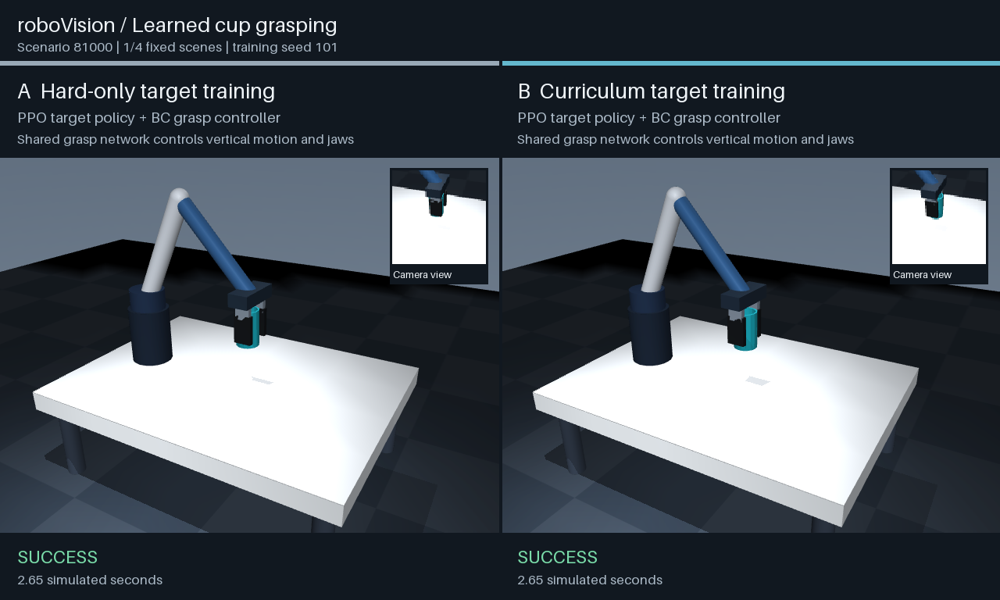

# roboVision

A simulated arm that finds, grips and lifts a cup in MuJoCo. PPO chooses where to reach. A second network, trained by behavior cloning, controls the lift and gripper.

The experiment compares a fixed reaching tolerance with a curriculum that tightens the tolerance as the policy improves.

[](assets/demo.mp4)

## Run

Requires Python 3.11 and [uv](https://docs.astral.sh/uv/).

```sh
uv sync --group dev
uv run python -m robovision demo --out runs/demo.mp4
```

The video compares both methods on the same scenes and shows the policy's camera view. It includes the first three test scenes and the first curriculum failure for training seed 101.

## How it works

1. A fixed 96 x 96 RGB camera observes the table. Color segmentation measures the cyan cup's position and shape in the image.
2. PPO uses those measurements and the robot's state to choose an XY target. Inverse kinematics moves the hand above it.
3. The behavior-cloned network moves the hand vertically and opens or closes the jaws at 20 Hz. An XY servo holds the chosen target.

The policies receive camera features and robot state. Simulator cup coordinates are used for demonstrations, rewards and evaluation. The arm lifts the cup through finger contact, with finite-force actuators and no grasp attachments.

Success requires a 0.5-second hold with both fingers touching and the cup's bottom at least 6 cm above the table. During the hold, tilt must stay below 20 degrees and speed below 0.1 m/s.

## Curriculum experiment

The approach policy makes one decision per episode and gets a binary reaching reward. Hard-only training requires 6 mm accuracy from the start. The curriculum starts at 60 mm and tightens to 6 mm. Each stage needs at least 2,048 interactions and 50% success over its latest 2,048 episodes before advancing.

Both methods use the same network, starting weights for each seed pair, exploration schedule and budget of 32,768 interactions. They share one grasp controller.

| Approach training | Physical grasp successes | Success rate |
| --- | ---: | ---: |
| Hard-only PPO | 364/3,000 | 12.1% |
| Curriculum PPO | 2,976/3,000 | 99.2% |

Each method was trained with six seeds and tested on the same 500 held-out scenes, giving 3,000 attempts per method. This comparison uses sparse, binary reaching rewards.

On matching test scenes, blacking out the camera reduced curriculum success from 591/600 to 64/600. Setting the grasp network's weights to zero gave 0/600.


[Full results](results/README.md) include scores for each seed, confidence intervals, failures and training times.

## Train and evaluate

Demonstrations are included in `data/grasp_demonstrations.npz`. To collect a new set and train the grasp controller:

```sh
uv run python -m robovision collect --out runs/demonstrations.npz --episodes 600
uv run python -m robovision train-grasp --data runs/demonstrations.npz --out runs/grasp --seed 201 --max-seconds 1200
```

Train the approach policy. Use `--method hard` for the baseline.

```sh
uv run python -m robovision train-target --method curriculum --run-dir runs/target --seed 101 --max-seconds 1200
```

Training saves the model and training state about every two minutes and when stopped. Runs stop after 20 minutes, once the current update finishes. Add `--resume` to the same command to continue. The recorded approach runs took about seven minutes each on an NVIDIA L4.

These commands save the approach model to `runs/target/target.pt` and the grasp model to `runs/grasp/checkpoint.pt`.

Evaluate an included model, rebuild the results or run the tests:

```sh
uv run python -m robovision evaluate --target models/target_seed101_curriculum.pt --grasp models/grasp.pt --episodes 100 --out runs/evaluation.json
uv run python -m robovision report
uv run pytest
```

## Scope

The camera, cup shape, color, mass and friction are fixed. Vision uses color segmentation and an MLP. Other cup appearances, camera positions and real hardware have not been tested. The grasp controller holds the chosen XY target, so it cannot correct a poor target prediction.
