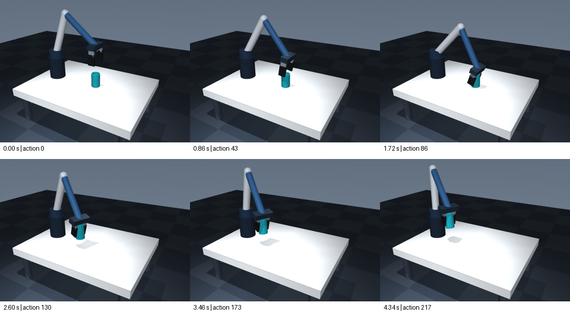

# roboVision

A simulated arm learns to approach, grasp, and lift a cup from camera images using
CNN policies and proximal policy optimization (PPO). The policies command joint
torques and finger force directly, learning to handle gravity and contact in MuJoCo.

**199 of 200 complete pickups (99.5%)** in the recorded evaluation, with the hand
starting directly above a fixed cup at sampled heights from 2.5 to 14 cm.

[](assets/demo.mp4)

The video shows the highest registered start: seed `741000152`, a 13.98 cm
height offset, and zero initial XY offset. It uses the same three policy checkpoints. [Demo details](benchmarks/demo.json) identify the scene and models.

## How it works

1. Two consecutive 96 × 96 RGB frames and 18 robot-state values feed learned CNN
   features. The policies do not receive the cup's simulator coordinates.
2. An approach policy brings the open hand toward the cup. Every five actions,
   a PPO manager decides whether to continue approaching or commit to pickup.
3. Once selected, the pickup policy controls the grasp, lift, and hold until the
   episode ends. Both specialists produce four joint torques and one symmetric
   finger-force command at 50 Hz; physics runs at 500 Hz.

Inverse kinematics sets initial poses. During the episode, the networks control
motor forces without scripted trajectories, gravity compensation, or grasp attachments.
The selected policies were trained through PPO curricula without teacher-action initialization.

## Learning the task

The curriculum starts with short holds of an already grasped cup, then introduces
lifting, finger closure, and descent from progressively higher starts. Rehearsal
preserves earlier skills as difficulty increases. Separate actor and critic updates,
controlled exploration, and millimeter height increments help stabilize learning.

The final controller combines an approach specialist, a pickup specialist trained
with approach arrival states, and a learned irreversible switch. The handoff keeps
physical state, image history, and the original episode deadline intact.
[Experiment notes](docs/experiments.md) give the measured curriculum comparisons behind the design.

## Results

| Recorded evaluation | Result |
| --- | ---: |
| Complete pickups | 199 / 200 |
| Success rate | 99.5% |
| 95% Wilson interval | 97.22–99.91% |
| Starts at least 10 cm above the grasp plane | 77 / 78 |
| Failures | 1 out of bounds |

Success requires bilateral finger contact, a centered grasp, at least 6 cm of
cup-bottom clearance, and a stable 0.5-second hold within 500 physical actions.
The evaluation samples continuous start heights uniformly from 2.5 to 14 cm.

[Episode records](benchmarks/centered-height-evaluation.json) and
[checkpoint hashes](benchmarks/final-model.json) provide the evidence. These are
measurements of the complete approach–grasp–lift–hold sequence.

## Run

Requires Python 3.11 or 3.12 and `uv`.

```sh
uv sync --group dev
uv run python -m robovision report
uv run pytest -q
```

The report summarizes the included results without model weights. To start the
initial PPO hold curriculum:

```sh
uv run python -m robovision train-joint --run-dir runs/hold-curriculum
```

The three trained checkpoints are included in `models/`. No cloud account is
needed to render the final controller or rerun its evaluation:

```sh
uv run python -m robovision demo --out runs/demo
uv run python -m robovision evaluate-final --out runs/final-evaluation
```

[Reproduction instructions](docs/reproduction.md) cover checkpoint layout, cloud
entrypoints, and the distinction between initial training and the full curriculum.

## Scope

The cup stays at world XY `(0.32, 0.0)` and the hand starts directly above it.
Camera pose, appearance, cup geometry, mass, and friction are fixed. The measured
variation is starting height; this result does not establish robustness to new
objects, horizontal placement, or real hardware. The evaluation covers one
selected policy stack, not multiple independent training seeds.
