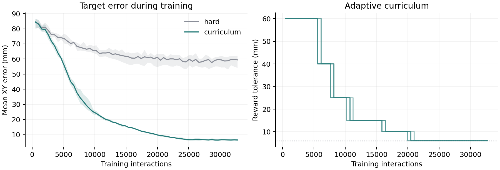

# Evaluation results

Both methods use the same behavior-cloned grasp controller. Each was trained with six seeds and tested on the same 500 scenes.

| Training seed | Hard-only | Curriculum |
| --- | ---: | ---: |
| 101 | 65/500 | 488/500 |
| 102 | 71/500 | 498/500 |
| 103 | 49/500 | 493/500 |
| 104 | 58/500 | 497/500 |
| 105 | 61/500 | 500/500 |
| 106 | 60/500 | 500/500 |

Curriculum gained **87.07 percentage points** on average. The 95% bootstrap interval is 85.83 to 88.20 points. It resamples the six seed pairs, with the grasp controller and 500 test scenes fixed.

| Method | Successes | Mean duration | Mean duration of successes | Failures |
| --- | ---: | ---: | ---: | --- |
| Hard-only | 364/3,000 (12.13%) | 8.05 s | 2.79 s | timeout: 2,624, out of bounds: 12 |
| Curriculum | 2,976/3,000 (99.20%) | 2.68 s | 2.64 s | timeout: 19, out of bounds: 5 |

Times are simulated and include the 0.8-second approach. A timeout means no stable grasp before the time limit; the cause is not recorded.

## Camera and grasp checks

These checks use the first 100 test scenes for all six curriculum policies.

| Change | Successes | Original on the same scenes |
| --- | ---: | ---: |
| Camera image set to black | 64/600 | 591/600 |
| Grasp network weights set to zero | 0/600 | 591/600 |

## Training

Each approach run completed 32,768 interactions in 398 to 412 seconds on an NVIDIA L4. Both methods started from identical weights within each seed pair.

All six curriculum runs completed the stages: 60, 40, 25, 15, 10 and 6 mm.

The shared grasp network used 600 successful demonstrations (22,217 steps), split into 480 training and 120 validation episodes. Collection took 17.70 seconds and 5,000 BC updates took 1.50 seconds.

On development scenes, the grasp controller scored 100/100 with the hand already aligned above the cup. The complete controller scored 12/100 for hard-only and 99/100 for curriculum. These scenes were separate from the final tests.

The curves include exploration noise during training. Shading shows the range across six seeds. Success rates from different curriculum stages use different tolerances, so they cannot be compared directly.

## Files

- [Episode records](episodes.csv.gz): all 7,200 evaluation episodes.
- [Training progress](training_progress.csv): all 12 approach runs.
- [Protocol](protocol.json): test scenes, success rules and confidence interval method.
- [Training metadata](training.json): settings, costs, promotions and grasp validation.
- [Collection log](demonstration_collection.csv): each attempt and its training or validation split.
- [Summary](summary.json): counts, durations, failure categories and confidence interval.

Rebuild this report with `uv run python -m robovision.report`.
